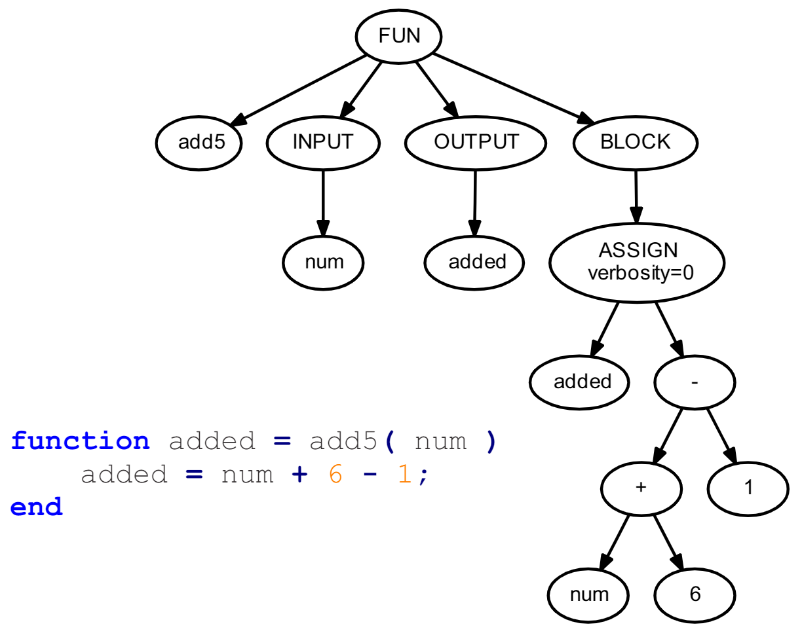

# MatlabToCppTranslator
This is an attempt to translate MATLAB scripts and functions to C++ and MEX code. It is a toy project from several years back, and only demonstrates the feasibility of an M-file MATLAB to C++ translator. The handling of variables with unresolved types using C++ union types is especially underdeveloped.

